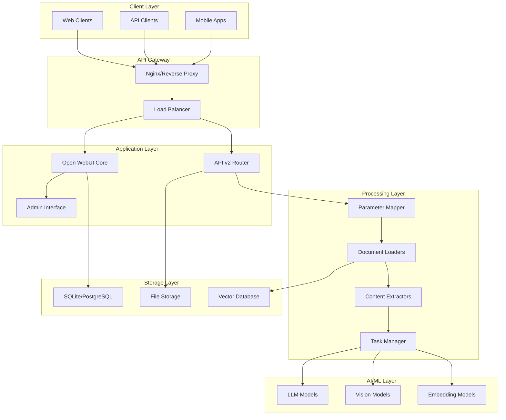
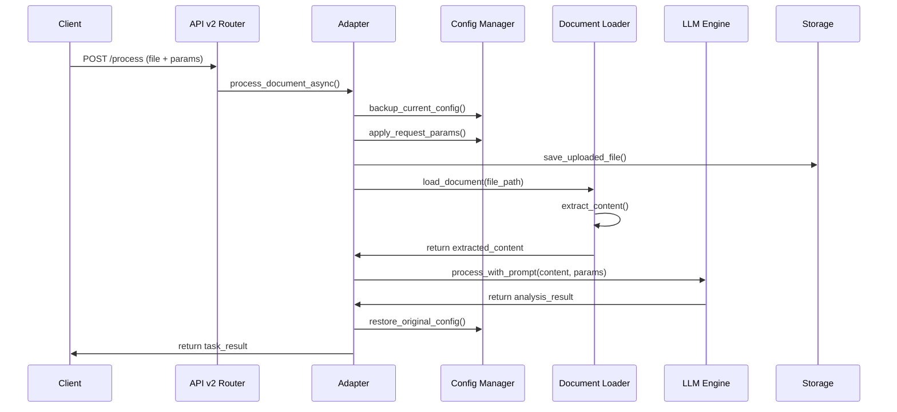
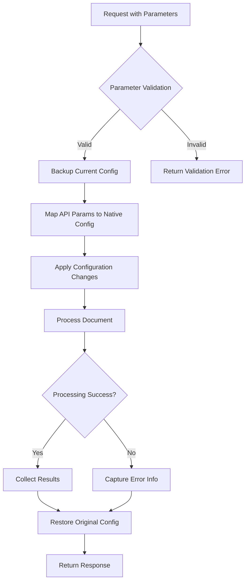
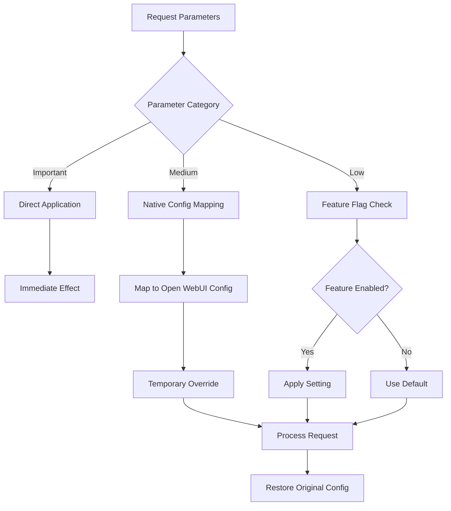
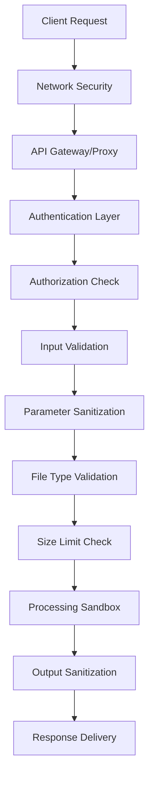

# Architecture Overview - Api-Doc-IA

> Technical deep dive into Api-Doc-IA's architecture and design decisions

## 🏗️ System Architecture

Api-Doc-IA is built on a **95% infrastructure reuse strategy**, leveraging Open WebUI's robust foundation while adding specialized document processing capabilities through API v2.



## 🎯 Design Principles

### 1. Infrastructure Reuse (95% Strategy)

**Principle:** Maximize reuse of Open WebUI's existing infrastructure rather than rebuilding components.

**Implementation:**
- **Database Models:** Reuse existing user, auth, and configuration models
- **Authentication:** Leverage existing JWT and API key systems
- **Configuration:** Map API v2 parameters to native Open WebUI settings
- **File Handling:** Utilize existing upload and storage mechanisms
- **LLM Integration:** Reuse model loading and inference pipelines

**Benefits:**
- Reduced development time and complexity
- Automatic inheritance of Open WebUI improvements
- Consistent behavior with main application
- Lower maintenance burden

### 2. Dynamic Configuration System

**Principle:** Enable per-request parameter customization without global state pollution.

**Implementation:**
```python
# Dynamic parameter mapping and restoration
class ParameterMapper:
    def apply_parameters(self, request, local_params):
        # Backup original configuration
        original_config = self.backup_config(request.app.state.config)
        
        # Apply request-specific parameters
        for param, config_key in self.config_mappings.items():
            if param in local_params:
                setattr(request.app.state.config, config_key, local_params[param])
        
        return original_config
    
    def restore_config(self, request, original_config):
        # Restore original configuration after processing
        for config_key, value in original_config.items():
            setattr(request.app.state.config, config_key, value)
```

### 3. Async-First Processing

**Principle:** All document processing operations are asynchronous to maintain system responsiveness.

**Implementation:**
- FastAPI BackgroundTasks for non-blocking processing
- Task status tracking with real-time updates
- Concurrent task management with configurable limits
- Progress reporting with percentage completion

## 🔧 Core Components

### 1. API v2 Router (`/backend/open_webui/routers/api_v2.py`)

**Purpose:** Main entry point for API v2 functionality

**Key Features:**
- RESTful endpoint definitions
- Request validation and parsing
- Authentication enforcement
- Response formatting
- Error handling and status codes

**Architecture Pattern:** 
```python
@router.post("/process", response_model=TaskResponse)
async def process_document(
    request: Request,
    file: UploadFile = File(...),
    prompt: str = Form(...),
    # ... other parameters
    user: UserModel = Depends(get_verified_user)
):
    # Delegate to adapter for processing
    return await adapter.process_document_async(...)
```

### 2. Document Adapter (`/backend/open_webui/api_v2/adapter.py`)

**Purpose:** Bridge between API v2 and Open WebUI's core functionality

**Key Responsibilities:**
- Parameter mapping and validation
- Dynamic configuration management
- Document processing orchestration
- Progress tracking and status updates
- Error handling and recovery

**Architecture Pattern:**
```python
class DocumentAdapter:
    async def process_document_async(self, request, file, parameters):
        # 1. Create task for tracking
        task = self.create_task(file.filename, parameters)
        
        # 2. Apply dynamic configuration
        original_config = self.apply_parameters(request, parameters)
        
        try:
            # 3. Process document using Open WebUI components
            result = await self.process_with_openwebui(file, parameters)
            
            # 4. Update task with results
            self.complete_task(task.id, result)
            
        finally:
            # 5. Restore original configuration
            self.restore_config(request, original_config)
```

### 3. Parameter Mapping System

**Purpose:** Intelligent mapping between API v2 parameters and Open WebUI native configurations

**Configuration Mappings:**
```python
config_mappings = {
    # PDF Processing
    'pdf_extract_images': 'PDF_EXTRACT_IMAGES',
    
    # RAG Configuration  
    'bypass_embedding_and_retrieval': 'BYPASS_EMBEDDING_AND_RETRIEVAL',
    'rag_full_context': 'RAG_FULL_CONTEXT',
    'enable_hybrid_search': 'ENABLE_RAG_HYBRID_SEARCH',
    
    # Text Processing
    'chunk_size': 'CHUNK_SIZE',
    'chunk_overlap': 'CHUNK_OVERLAP',
    'text_splitter': 'TEXT_SPLITTER',
    
    # Search Configuration
    'top_k': 'TOP_K',
    'top_k_reranker': 'TOP_K_RERANKER',
    'relevance_threshold': 'RELEVANCE_THRESHOLD',
    
    # Extraction
    'content_extraction_engine': 'CONTENT_EXTRACTION_ENGINE'
}
```

### 4. Task Management System

**Purpose:** Handle asynchronous processing with status tracking

**Components:**
- **TaskTracker:** In-memory task status management
- **ProgressReporter:** Real-time progress updates
- **TaskCleaner:** Automatic cleanup of completed tasks

**Data Flow:**
```python
class TaskTracker:
    def __init__(self):
        self.tasks = {}  # task_id -> TaskStatus
        self.max_concurrent = 6
        
    async def create_task(self, task_info):
        task = TaskStatus(
            id=uuid4(),
            status="pending",
            progress=0.0,
            created_at=datetime.now()
        )
        self.tasks[task.id] = task
        return task
    
    async def update_progress(self, task_id, progress, step):
        if task_id in self.tasks:
            self.tasks[task_id].progress = progress
            self.tasks[task_id].current_step = step
```

## 📊 Data Flow Architecture

### Document Processing Pipeline



### Parameter Application Flow



## 🔌 Integration Points

### 1. Open WebUI Core Integration

**File Loaders Integration:**
```python
# Reuse existing Open WebUI document loaders
from open_webui.retrieval.loaders.main import Loaders

async def extract_content(file_path, file_type):
    # Leverage Open WebUI's sophisticated loader system
    loader_instance = Loaders[file_type]
    content = await loader_instance.load(file_path)
    return content
```

**Model Integration:**
```python
# Reuse model management and inference
from open_webui.models.models import Models

def get_available_models():
    # Get models from Open WebUI's model registry
    return Models.get_models()

async def generate_response(model_id, prompt, parameters):
    # Use Open WebUI's model inference pipeline
    model = Models.get_model_by_id(model_id)
    return await model.generate(prompt, **parameters)
```

### 2. Authentication System Integration

**API Key System:**
```python
# Leverage existing API key infrastructure
from open_webui.utils.auth import get_verified_user

@router.post("/process")
async def process_document(
    user: UserModel = Depends(get_verified_user)  # Reuse auth system
):
    # User is automatically validated
    pass
```

**Permission System:**
```python
# Integrate with Open WebUI's permission system
from open_webui.utils.access_control import get_permissions

def check_api_permissions(user):
    permissions = get_permissions(user.id, config.USER_PERMISSIONS)
    return "api.read" in permissions and "api.write" in permissions
```

### 3. Configuration System Integration

**Dynamic Configuration Pattern:**
```python
class ConfigurationManager:
    def __init__(self, app_config):
        self.app_config = app_config
        
    def apply_temporary_config(self, overrides):
        # Create backup of current state
        backup = {}
        for key, value in overrides.items():
            if hasattr(self.app_config, key):
                backup[key] = getattr(self.app_config, key)
                setattr(self.app_config, key, value)
        return backup
    
    def restore_config(self, backup):
        # Restore previous state
        for key, value in backup.items():
            setattr(self.app_config, key, value)
```

## 🎛️ Configuration Architecture

### Parameter Hierarchy



### Configuration Categories

**Important Parameters (Always Working):**
- Directly control API v2 behavior
- No dependency on Open WebUI features
- Immediate application and effect

```python
important_params = {
    'temperature': 'LLM_TEMPERATURE',
    'max_tokens': 'MAX_OUTPUT_TOKENS', 
    'max_concurrent_tasks': 'API_V2_CONCURRENT_LIMIT',
    'enable_api_v2': 'API_V2_ENABLED'
}
```

**Medium Parameters (Native Integration):**
- Map to existing Open WebUI configurations
- Leverage proven functionality
- Consistent with main application behavior

```python
medium_params = {
    'pdf_extract_images': 'PDF_EXTRACT_IMAGES',
    'rag_full_context': 'RAG_FULL_CONTEXT',
    'chunk_size': 'CHUNK_SIZE',
    # ... 8 additional mappings
}
```

**Low Priority Parameters (Mixed Status):**
- Experimental or future features
- May require additional implementation
- Graceful degradation when unavailable

## 📈 Performance Architecture

### Concurrent Processing Design

**Task Queue Management:**
```python
class ConcurrentTaskManager:
    def __init__(self, max_concurrent=6):
        self.max_concurrent = max_concurrent
        self.active_tasks = set()
        self.task_queue = asyncio.Queue()
        
    async def submit_task(self, task_func, *args, **kwargs):
        if len(self.active_tasks) < self.max_concurrent:
            # Process immediately
            task = asyncio.create_task(task_func(*args, **kwargs))
            self.active_tasks.add(task)
            return task
        else:
            # Queue for later processing
            await self.task_queue.put((task_func, args, kwargs))
```

### Memory Management

**Automatic Cleanup Strategy:**
```python
class ResourceManager:
    def __init__(self):
        self.temp_files = set()
        self.active_tasks = {}
        
    async def cleanup_task(self, task_id):
        # Remove temporary files
        if task_id in self.temp_files:
            for file_path in self.temp_files[task_id]:
                try:
                    os.unlink(file_path)
                except FileNotFoundError:
                    pass
            del self.temp_files[task_id]
        
        # Clear task data
        if task_id in self.active_tasks:
            del self.active_tasks[task_id]
```

### Caching Strategy

**Multi-Level Caching:**
```python
class CacheManager:
    def __init__(self):
        self.content_cache = {}  # File content cache
        self.result_cache = {}   # Processing result cache
        
    async def get_cached_content(self, file_hash):
        # Check if file content is already extracted
        return self.content_cache.get(file_hash)
    
    async def cache_processing_result(self, params_hash, result):
        # Cache LLM processing results for identical parameters
        self.result_cache[params_hash] = {
            'result': result,
            'timestamp': time.time(),
            'ttl': 3600  # 1 hour
        }
```

## 🔒 Security Architecture

### Multi-Layer Security Model



### File Security Pipeline

**Upload Validation:**
```python
class FileValidator:
    ALLOWED_EXTENSIONS = {'.pdf', '.docx', '.doc', '.txt', '.md', '.xls', '.xlsx'}
    MAX_FILE_SIZE = 50 * 1024 * 1024  # 50MB
    
    async def validate_file(self, file: UploadFile):
        # Extension check
        if not self.is_allowed_extension(file.filename):
            raise ValidationError("File type not supported")
        
        # Size check
        content = await file.read()
        if len(content) > self.MAX_FILE_SIZE:
            raise ValidationError("File too large")
        
        # MIME type verification
        detected_type = magic.from_buffer(content, mime=True)
        if not self.is_allowed_mime_type(detected_type):
            raise ValidationError("Invalid file content")
        
        return content
```

### Parameter Security

**Input Sanitization:**
```python
class ParameterSanitizer:
    def sanitize_prompt(self, prompt: str) -> str:
        # Remove potential injection patterns
        prompt = re.sub(r'[<>"\']', '', prompt)
        
        # Limit length
        if len(prompt) > 10000:
            prompt = prompt[:10000]
        
        return prompt.strip()
    
    def validate_numeric_params(self, params: dict) -> dict:
        # Ensure numeric parameters are within safe ranges
        safe_params = {}
        
        if 'temperature' in params:
            safe_params['temperature'] = max(0.0, min(1.0, float(params['temperature'])))
        
        if 'max_tokens' in params:
            safe_params['max_tokens'] = max(1, min(8192, int(params['max_tokens'])))
        
        return safe_params
```

## 🚀 Scalability Architecture

### Horizontal Scaling Design

**Load Distribution:**
```python
class LoadBalancer:
    def __init__(self, instances):
        self.instances = instances
        self.current_loads = {instance: 0 for instance in instances}
    
    def get_least_loaded_instance(self):
        return min(self.instances, key=lambda x: self.current_loads[x])
    
    async def distribute_task(self, task):
        instance = self.get_least_loaded_instance()
        self.current_loads[instance] += 1
        
        try:
            result = await instance.process_task(task)
            return result
        finally:
            self.current_loads[instance] -= 1
```

### Database Scaling Strategy

**Multi-Database Support:**
```python
class DatabaseManager:
    def __init__(self):
        self.read_db = self.connect_read_replica()
        self.write_db = self.connect_primary()
    
    async def read_operation(self, query):
        # Use read replica for queries
        return await self.read_db.execute(query)
    
    async def write_operation(self, query):
        # Use primary for writes
        return await self.write_db.execute(query)
```

## 📊 Monitoring Architecture

### Health Check System

**Comprehensive Health Monitoring:**
```python
class HealthChecker:
    async def check_system_health(self):
        checks = {
            'database': await self.check_database(),
            'storage': await self.check_file_storage(),
            'models': await self.check_model_availability(),
            'memory': await self.check_memory_usage(),
            'disk': await self.check_disk_space()
        }
        
        overall_status = 'healthy'
        if any(not status for status in checks.values()):
            overall_status = 'degraded'
        if checks['database'] is False:
            overall_status = 'down'
        
        return {
            'status': overall_status,
            'checks': checks,
            'timestamp': time.time()
        }
```

### Performance Metrics

**Key Performance Indicators:**
```python
class MetricsCollector:
    def __init__(self):
        self.metrics = {
            'requests_per_minute': 0,
            'avg_processing_time': 0,
            'active_tasks': 0,
            'queue_length': 0,
            'error_rate': 0,
            'memory_usage_percent': 0
        }
    
    async def collect_metrics(self):
        # Collect real-time system metrics
        self.metrics.update({
            'active_tasks': len(task_manager.active_tasks),
            'queue_length': task_manager.queue_size(),
            'memory_usage_percent': psutil.virtual_memory().percent
        })
        
        return self.metrics
```

## 🔄 Future Architecture Considerations

### Planned Enhancements

**Microservices Migration:**
- Document processing service separation
- Dedicated model inference service
- Centralized configuration service
- Event-driven architecture with message queues

**Advanced Caching:**
- Redis integration for distributed caching
- Content-based caching with hash comparison
- Intelligent cache invalidation strategies

**Enhanced Security:**
- Document content scanning for sensitive data
- Audit logging for all API operations
- Advanced rate limiting with user-based quotas

### Extensibility Points

**Plugin Architecture:**
```python
class ProcessingPlugin:
    def __init__(self, name: str):
        self.name = name
    
    async def pre_process(self, content: str) -> str:
        """Override to modify content before LLM processing"""
        return content
    
    async def post_process(self, result: str) -> str:
        """Override to modify result after LLM processing"""
        return result

class PluginManager:
    def __init__(self):
        self.plugins = []
    
    def register_plugin(self, plugin: ProcessingPlugin):
        self.plugins.append(plugin)
    
    async def apply_pre_processing(self, content: str) -> str:
        for plugin in self.plugins:
            content = await plugin.pre_process(content)
        return content
```

## 📋 Architecture Decision Records (ADRs)

### ADR-001: Infrastructure Reuse Strategy

**Decision:** Reuse 95% of Open WebUI's existing infrastructure instead of building custom components.

**Rationale:**
- Faster development and reduced complexity
- Automatic inheritance of improvements and bug fixes
- Consistent behavior with main application
- Lower maintenance overhead

**Consequences:**
- Dependent on Open WebUI's architectural decisions
- Limited flexibility for custom infrastructure needs
- Requires deep understanding of Open WebUI internals

### ADR-002: Dynamic Configuration System

**Decision:** Implement per-request configuration overrides with automatic restoration.

**Rationale:**
- Enables customizable processing without global state pollution
- Maintains thread safety in concurrent environments
- Provides clean separation between requests
- Allows fine-grained control over processing parameters

**Consequences:**
- Slight performance overhead for configuration backup/restore
- Requires careful management of configuration state
- Additional complexity in parameter mapping logic

### ADR-003: Async-First Design

**Decision:** All document processing operations are asynchronous by default.

**Rationale:**
- Maintains system responsiveness under load
- Enables concurrent processing of multiple documents
- Provides better resource utilization
- Supports real-time progress tracking

**Consequences:**
- Increased complexity in error handling
- Requires careful management of async resources
- Additional overhead for task tracking and status management

---

**This architecture is designed for production scale and extensibility.** The combination of infrastructure reuse, dynamic configuration, and async processing provides a robust foundation for intelligent document processing. 🏗️