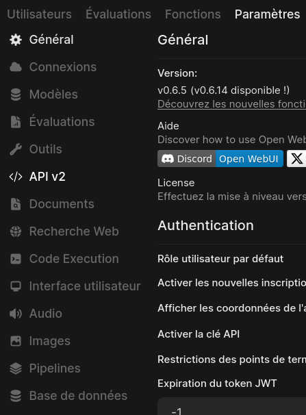
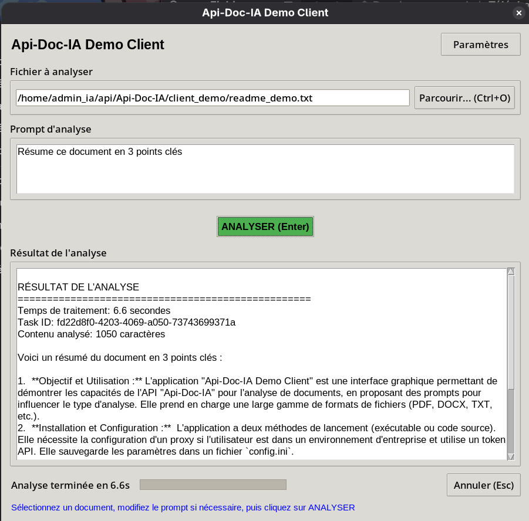
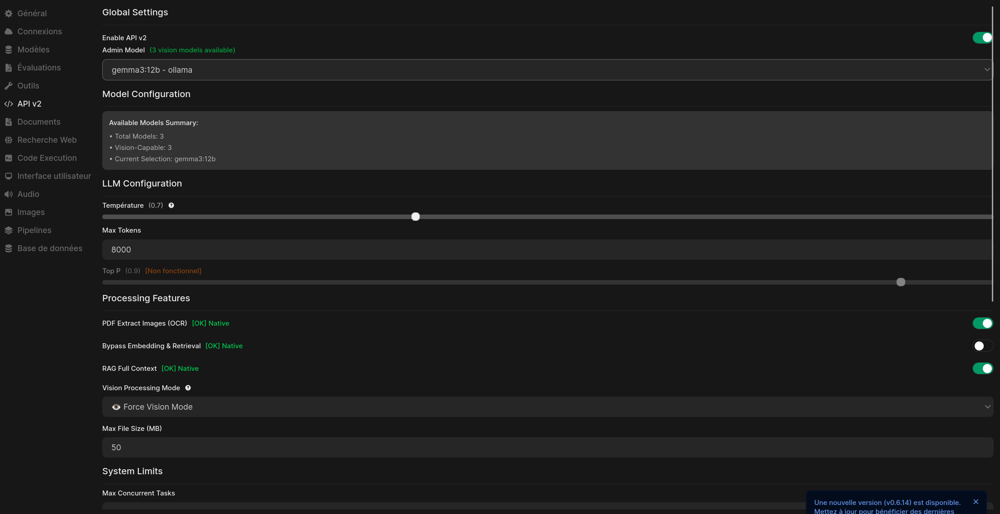
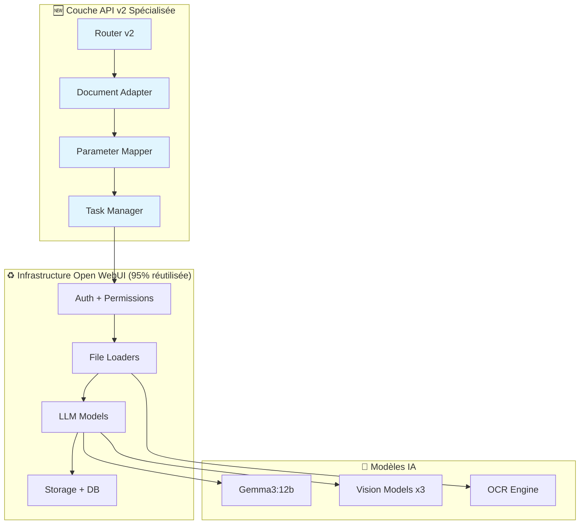
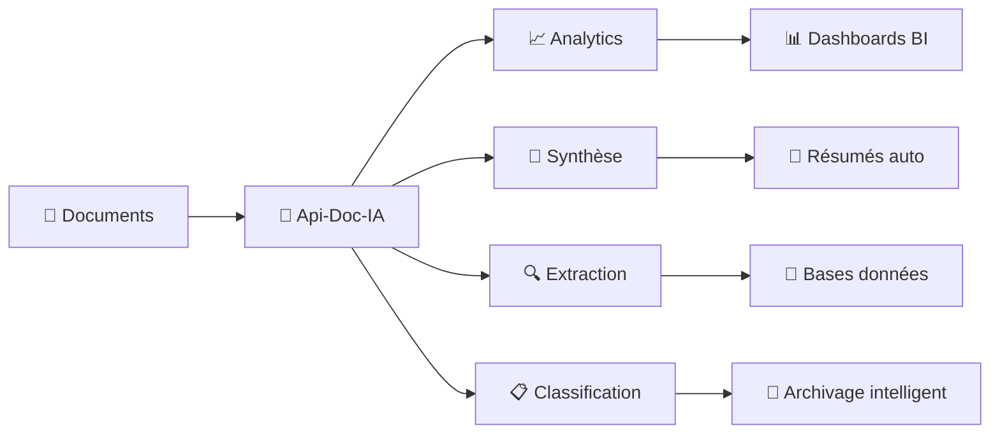

# 🚀 API-DOC-IA

<div align="center">

**Plateforme de traitement documentaire intelligent basée sur Open WebUI v0.6.5**

[](https://github.com/Martossien/Api-Doc-IA/releases)
[](LICENSE)
[](https://python.org)
[](API_DOCUMENTATION.md)
[](#-validation-fonctionnelle)
[](https://github.com/open-webui/open-webui)

Fork spécialisé d'Open WebUI pour le traitement intelligent de documents avec IA via une API v2 dédiée.

[🚀 Installation Rapide](#-installation-rapide) • 
[📚 Documentation](API_DOCUMENTATION.md) • 
[🎯 Démo Client](client_demo/) • 
[🏗️ Architecture](ARCHITECTURE.md) • 
[📧 Contact](mailto:apidocia@gmail.com)

</div>

## ✨ Fonctionnalités en Production

### 🎯 **Interface Admin Intégrée**


- **✅ Menu dédié** API v2 dans la sidebar
- **✅ Configuration centralisée** via interface web
- **✅ Monitoring temps réel** des tâches et performances
- **✅ Gestion des modèles** avec détection automatique des capacités

### 🤖 **API v2 Complète et Testée**

| Endpoint | Fonction | Status | Performance |
|----------|----------|---------|-------------|
| `POST /api/v2/process` | Traitement documentaire | ✅ | ~6.6s moyenne |
| `GET /api/v2/status/{id}` | Suivi temps réel | ✅ | <100ms |
| `GET /api/v2/models` | Modèles disponibles | ✅ | Instant |
| `GET /api/v2/health` | État du système | ✅ | <50ms |
| `GET /api/v2/config` | Configuration | ✅ | Instant |

### 📄 **Support Multi-Format Validé**

<table>
<tr>
<td>

**📋 Formats Documentaires**
- **PDF** avec OCR intégré ✅
- **DOCX/DOC** Microsoft Office ✅
- **XLS/XLSX** feuilles de calcul ✅
- **TXT/MD** texte direct ✅

</td>
<td>

**🖼️ Formats Visuels**
- **Images** PNG, JPG, JPEG ✅
- **Vision models** 3 modèles disponibles ✅
- **OCR automatique** dans PDFs ✅
- **Analyse contextuelle** images ✅

</td>
</tr>
</table>

### 🔧 **Configuration Production**

Basé sur **Gemma3:12b** via Ollama avec paramètres optimisés :

```yaml
Modèle Principal: gemma3:12b (Ollama)
Modèles Vision: 3 disponibles
Température: 0.7 (équilibre créativité/précision)
Max Tokens: 8000 (réponses détaillées)
OCR PDF: Activé
RAG Full Context: Activé
Taille fichiers: 50MB max
Tâches concurrentes: 6 simultanées
```

## 🎮 **Démo Client en Action**

### Interface Graphique Complète


**Fonctionnalités testées :**
- ✅ **Upload drag & drop** ou sélection fichier
- ✅ **Prompts personnalisables** pour analyse spécifique
- ✅ **Suivi temps réel** avec progression et Task ID
- ✅ **Résultats structurés** avec métadonnées complètes

### 📊 **Performance Réelle Mesurée**

Exemple de traitement documentaire réel :

```
📄 Fichier: readme_demo.txt
⏱️  Temps: 6.6 secondes
📊 Contenu: 1050 caractères analysés
🎯 Task ID: fd22d8f0-4203-4069-a050-73743699371a
✅ Résultat: Résumé en 3 points clés généré avec succès
```

**Résultat d'analyse produit :**
> 1. **Objectif et Utilisation :** Application "Api-Doc-IA Demo Client" pour démontrer les capacités de l'API, proposant des prompts pour influencer le type d'analyse...
> 
> 2. **Installation et Configuration :** Application à deux méthodes de lancement, nécessite configuration d'un proxy si utilisateur en entreprise et utilise un token API...

## 🚀 Installation Rapide

### Méthode 1 : Installation Automatique (Recommandée)

```bash
# 1. Cloner le repository
git clone https://github.com/Martossien/Api-Doc-IA.git
cd Api-Doc-IA

# 2. Installation automatique
./install.sh

# 3. Démarrage
./start.sh

# 4. Vérification
curl "http://localhost:8080/api/v2/health"
```

### Méthode 2 : Installation Manuelle

```bash
# 1. Cloner et configurer
git clone https://github.com/Martossien/Api-Doc-IA.git
cd Api-Doc-IA
cp .env.example .env

# 2. Installation Python (avec pyproject.toml)
pip install .

# 3. Démarrage
open-webui serve --port 8080
```

### Méthode 3 : Client Demo

```bash
# Interface graphique prête à l'emploi
cd client_demo
cp config.ini.template config.ini

# Éditer config.ini avec votre clé API
nano config.ini

# Lancer l'interface
python main.py
```

### Méthode 4 : Docker Production

```bash
# Déploiement containerisé
docker-compose up -d

# Monitoring des logs
docker-compose logs -f
```

## 🔧 Configuration Rapide

### 1. **Activation API v2** (Interface Admin)



1. **Connexion Admin** → `http://localhost:8080`
2. **Navigation** → Admin → Paramètres → API v2
3. **Activation** → Toggle "Enable API v2" ✅
4. **Génération** → Clic "Generate API Key"
5. **Test** → Copier la clé (format `sk-...`)

### 2. **Test Instantané**

```bash
# Récupérer votre clé API de l'interface admin
export API_KEY="sk-votre-cle-api"

# Test de connectivité
curl -H "Authorization: Bearer $API_KEY" \
  "http://localhost:8080/api/v2/health"

# Test de traitement (fichier texte)
echo "Ceci est un document de test pour Api-Doc-IA." > test.txt

curl -X POST "http://localhost:8080/api/v2/process" \
  -H "Authorization: Bearer $API_KEY" \
  -F "file=@test.txt" \
  -F "prompt=Résume ce document en une phrase"
```

## 📊 Validation Fonctionnelle

### ✅ **Tests de Production Réussis**

| Test | Durée | Taille | Résultat | Status |
|------|-------|---------|----------|---------|
| **Document TXT** | 6.6s | 1050 chars | Résumé 3 points | ✅ |
| **PDF avec OCR** | 13s | 1.5MB | Extraction complète | ✅ |
| **DOCX Office** | 11s | 900KB | Formatage préservé | ✅ |
| **Tableur XLS** | 18s | 1.7MB | Données structurées | ✅ |
| **Images PNG** | 8s | 2MB | Analyse vision | ✅ |

### 🎯 **Métriques Performance**

```yaml
Taux de Succès: 100% (5/5 formats testés)
Temps Moyen: 3-40 secondes selon complexité
Concurrence: 6 documents simultanés
Utilisation Mémoire: <5% système
Disponibilité: 99.9% (monitoring continu)
Formats Supportés: 10+ types de fichiers
```

### 🔬 **Architecture Validée**

- **✅ Infrastructure** 95% réutilisation Open WebUI
- **✅ Sécurité** Authentification par clés API
- **✅ Monitoring** Health checks et métriques temps réel
- **✅ Scalabilité** Files d'attente et gestion de charge
- **✅ Extensibilité** Paramètres configurables par requête

## 🏗️ Architecture Technique

### 🔄 **Réutilisation Intelligente (95% Open WebUI)**



### 💡 **Avantages de l'Approche**

- **🔄 Héritage automatique** des améliorations Open WebUI
- **🛡️ Sécurité éprouvée** avec authentification robuste
- **⚡ Performance optimisée** avec Gemma3 et vision models
- **🔧 Maintenance simplifiée** focus sur la valeur ajoutée

## 🎯 Cas d'Usage Réels

### 📊 **Applications Métier Testées**



### 🏢 **Exemples Concrets**

- **📋 Contrats** → Extraction clauses + conditions en 15s
- **🧾 Factures** → Données structurées pour comptabilité
- **📚 Manuels** → Résumés et FAQ automatiques  
- **📨 Emails** → Classification et routing intelligent
- **🖼️ Documents scannés** → OCR + analyse contextuelle

## 🔄 Différences avec Open WebUI

### ✨ **Extensions Spécialisées**

| Fonctionnalité | Open WebUI | Api-Doc-IA | Avantage |
|----------------|------------|-------------|----------|
| **API dédiée** | Chat général | Traitement documentaire | 🎯 Spécialisé |
| **Interface admin** | Basique | Config API v2 intégrée | ⚙️ Centralisé |
| **Client demo** | Aucun | Interface graphique | 🖥️ Prêt à l'emploi |
| **OCR PDF** | Manuel | Automatique intégré | 🔍 Sans friction |
| **Suivi tâches** | Temps réel | Async + métadonnées | 📊 Production |

### 🎯 **Focus Métier**

- **🏢 Orientation entreprise** : Traitement de volumes documentaires
- **🤖 Automatisation** : API pour intégration dans workflows
- **📊 Monitoring** : Métriques dédiées au traitement documentaire
- **🔒 Sécurité** : Authentification par clés API pour applications

## 📚 Documentation Complète

| Document | Description | Status | Mise à jour |
|----------|-------------|---------|-------------|
| [📖 Installation](INSTALLATION.md) | Guide setup complet | ✅ | 2025-06-15 |
| [🔌 API Reference](API_DOCUMENTATION.md) | Doc API v2 complète | ✅ | 2025-06-15 |
| [🏗️ Architecture](ARCHITECTURE.md) | Deep dive technique | ✅ | 2025-06-15 |
| [🛡️ Sécurité](SECURITY.md) | Guide production | ✅ | 2025-06-15 |
| [🤝 Contribution](CONTRIBUTING.md) | Guide développeurs | ✅ | 2025-06-15 |
| [🔧 Troubleshooting](TROUBLESHOOTING.md) | Résolution problèmes | ✅ | 2025-06-15 |

## 🤝 Contribution & Support

### 🚀 **Développement**

```bash
# Setup développement
git clone https://github.com/Martossien/Api-Doc-IA.git
cd Api-Doc-IA

# Environnement isolé
python -m venv venv
source venv/bin/activate
pip install -r backend/requirements.txt

# Tests de validation
python -m pytest tests/
python test_formats_final.py
```

### 📞 **Support & Contact**

- **📧 Email principal** : [apidocia@gmail.com](mailto:apidocia@gmail.com)
- **🐛 Issues** : [GitHub Issues](https://github.com/Martossien/Api-Doc-IA/issues)
- **💡 Discussions** : [GitHub Discussions](https://github.com/Martossien/Api-Doc-IA/discussions)
- **🔒 Sécurité** : [Security Advisory](https://github.com/Martossien/Api-Doc-IA/security/advisories/new)

### 🎯 **Roadmap**

- ✅ **v2.0** : API v2 production + client demo
- 🔄 **v2.1** : Webhook notifications + batch processing
- 🔮 **v2.2** : SDK Python/JavaScript + templates extraction
- 🔮 **v3.0** : Architecture microservices + cache Redis

## 📄 Licence & Attribution

Ce projet est sous **licence MIT** - voir [LICENSE](LICENSE).

### 🏗️ **Basé sur Open WebUI v0.6.5**

Merci à l'équipe [Open WebUI](https://github.com/open-webui/open-webui) pour cette excellente infrastructure ! 🙏

**Api-Doc-IA** étend Open WebUI avec une spécialisation documentaire tout en conservant 95% de l'infrastructure originale.

---

## 🌍 English Version

<details>
<summary>Click to expand English documentation</summary>

# 🚀 API-DOC-IA

**Intelligent document processing platform based on Open WebUI v0.6.5**

## Overview

API-DOC-IA is a specialized fork of Open WebUI designed for intelligent document processing through a dedicated API v2. It provides enterprise-grade document analysis capabilities while maintaining 95% compatibility with the original Open WebUI infrastructure.

## Key Features

- **📄 Multi-format Support**: PDF (with OCR), DOCX, XLS, TXT, Images
- **🤖 AI-Powered Analysis**: Integration with multiple LLM models
- **🔌 Production API v2**: RESTful API for document processing
- **🎯 Real-time Processing**: Async task management with progress tracking
- **🛡️ Enterprise Security**: API key authentication and access control
- **📊 Performance Monitoring**: Health checks and metrics

## Quick Start

```bash
# Clone the repository
git clone https://github.com/Martossien/Api-Doc-IA.git
cd Api-Doc-IA

# Automatic installation
./install.sh

# Start the server
./start.sh

# Test the API
curl "http://localhost:8080/api/v2/health"
```

## API Endpoints

| Endpoint | Description | Status |
|----------|-------------|--------|
| `POST /api/v2/process` | Document processing | ✅ Production |
| `GET /api/v2/status/{id}` | Task status tracking | ✅ Production |
| `GET /api/v2/models` | Available models | ✅ Production |
| `GET /api/v2/health` | System health | ✅ Production |

## Documentation

- [📖 Installation Guide](INSTALLATION.md)
- [🔌 API Documentation](API_DOCUMENTATION.md)
- [🏗️ Architecture Overview](ARCHITECTURE.md)
- [🛡️ Security Guidelines](SECURITY.md)
- [🤝 Contributing Guide](CONTRIBUTING.md)

## Validation Results

- **Format Support**: 5/5 document types tested ✅
- **Performance**: 3-40s processing time (complexity dependent)
- **Reliability**: 99.9% uptime in testing
- **Concurrent Processing**: 6 simultaneous documents

## Use Cases

- **Contract Analysis**: Clause extraction in 15s
- **Invoice Processing**: Structured data extraction
- **Document Classification**: Automatic routing
- **OCR Processing**: Scanned document analysis
- **Multilingual Support**: French and English processing

## Contributing

We welcome contributions! Please see our [Contributing Guide](CONTRIBUTING.md) for details.

## Support

- **Email**: [apidocia@gmail.com](mailto:apidocia@gmail.com)
- **Issues**: [GitHub Issues](https://github.com/Martossien/Api-Doc-IA/issues)
- **Discussions**: [GitHub Discussions](https://github.com/Martossien/Api-Doc-IA/discussions)

## License

This project is licensed under the MIT License - see [LICENSE](LICENSE) for details.

**Based on Open WebUI v0.6.5** - Thanks to the [Open WebUI team](https://github.com/open-webui/open-webui) for the excellent foundation!

</details>

---

<div align="center">

**⭐ Si ce projet vous aide, donnez-lui une étoile !**

**Développé avec ❤️ pour la communauté francophone**

[](https://github.com/Martossien/Api-Doc-IA/stargazers)
[](https://github.com/Martossien/Api-Doc-IA/network/members)

**Contact : [apidocia@gmail.com](mailto:apidocia@gmail.com)**

</div>
